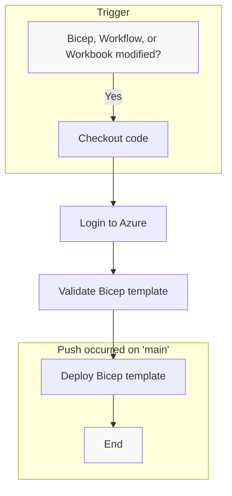

<h1 align="center">
    <picture>
        <source media="(prefers-color-scheme: dark)" srcset="https://user-images.githubusercontent.com/3996360/231610699-a18b16c0-99d5-465c-a58c-90b97409f3fb.svg">
        <source media="(prefers-color-scheme: light)" srcset="https://user-images.githubusercontent.com/3996360/231610697-3f40ae17-918c-46d4-9be5-6f7d1b61b7e1.svg">
        
    </picture>
</h1>

[](https://github.com/bartvdbraak/azure-audit-workbooks/actions/workflows/build-deploy.yaml)

## Usage

### Deploying the Workbook(s)

To deploy the Workbooks locally, you can use the provided Bicep templates located in the bicep directory. Before deploying, ensure that you have filled in the required parameters in `main.params.json`. You will also need to create a new `.env` file based on `.env.example` and fill in the required values.

To deploy the templates, run the following command:

```bash
cd scripts
./deploy.sh
```

For more information about the Bicep templates and how to customize them, please refer to the [Bicep documentation](https://docs.microsoft.com/en-us/azure/azure-resource-manager/bicep/).

## Workflows

To ensure efficient and automated deployments, we have developed the following Github Action workflows:

### `build-deploy.yaml`

This workflow automates the deployment process for our Azure infrastructure. The workflow is triggered whenever there is a push to the main branch and checks if any changes were made to the Bicep template or workflow. If so, it checks out the code, logs in to Azure, validates the Bicep template, and deploys it.



In addition, we have implemented `dependabot` to suggest updating new versions of our Github Actions, ensuring that we always have the latest and most secure versions of our dependencies.

## License

This project is licensed under the terms of the MIT license. See the [LICENSE](./LICENSE) file for details.
